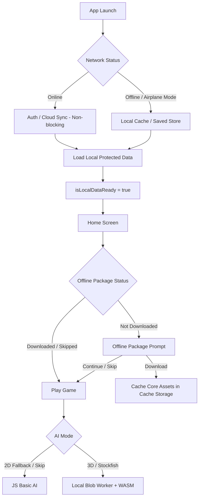

# Phase 18: Offline-First AI Runtime & Offline Package System

This document details the architecture, implementation details, and verification steps for Phase 18 of *Clash of Crowns*. This phase ensures the game functions completely offline in airplane mode, supports an optional offline assets package, loads Stockfish locally, and fixes 3D camera damping and AI thinking performance lags.

---

## 1. Architectural Design

The offline capability architecture decouples local application readiness from cloud synchronization (Firebase) and adds a caching layer for core game assets.



### Key Modules Added/Updated:
1. **Offline Capability Layer (`src/lib/offline/offlineCapabilities.ts`)**: Defines which modules (AI career, profile, settings, customization) are allowed offline vs online-only.
2. **Network Status Service (`src/lib/offline/networkStatus.ts`)**: Monitors network changes and exposes a subscription mechanism.
3. **Offline Mode Service (`src/lib/offline/offlineMode.ts`)**: Decides if a features can be used or should be blocked.
4. **Local Player Store (`src/lib/offline/localPlayerStore.ts`)**: Loads/saves protected player data locally.
5. **Offline Sync Queue (`src/lib/offline/syncQueue.ts`)**: Queues rewards, levels unlocked, and badges won offline. Events are stored in `clash_offline_sync_queue` and will be synchronized in Phase 19.
6. **Offline Package Downloader (`src/lib/offline/offlinePackage.ts`)**: Implements Cache Storage for core files (`sf.js`, `sf.wasm`, `bgm.mp3`, `home-bg-mobile.webp`). High-graphics resources like `homeanimation.mp4` are made optional to allow lightweight local play.
7. **Offline UI Prompt (`src/components/ui/OfflinePackageModal.tsx`)**: Integrates visual modal prompting download, skip, retry, and "Continue Without Download".
8. **Stockfish Local Loading (`src/services/stockfishService.ts`)**: Dynamically loads JS & WASM assets offline. Overrides the relative web worker path with an in-memory binary Blob URL and buffers initialization commands.

---

## 2. Decoupled Startup & Firebase Optionality

To prevent the splash screen from hanging in airplane mode:
- **Decoupled states**:
  - `isLocalDataReady`: Set to `true` as soon as local data is loaded from the protected save system.
  - `isCloudSyncReady`: Set to `true` only if Firebase auth and Firestore progress sync completes.
- **Silent failure**: All Firebase listeners (`onAuthStateChanged`, `onSnapshot`) are wrapped in `try/catch` and fail silently to guest mode if the network is absent.
- **Splash transition**: The app exits the Splash screen and launches Home once `isLocalDataReady` is `true`.

---

## 3. Stockfish Offline Worker Injection

Loading a Web Worker from a cache storage URL requires overriding the absolute reference inside the script. We achieve this by:
1. Fetching `sf.js` and `sf.wasm` from `caches` or local fallback files.
2. Generating a local object URL (`blob:`) for the WASM file.
3. Substituting the relative string path `'w="stockfish.wasm"'` with `'w="blob:..."'` inside the JS text.
4. Injecting the modified JS text into a Web Worker through a javascript Blob URL.

This completely bypasses CORS restrictions and network requests, running Grandmaster-tier AI on Capacitor Android and browsers without internet access.

---

## 4. UI, Camera & 3D Performance Fixes

### OrbitControls Tweaks
Applied damping and constraints directly to the OrbitControls setup in `GameScreen.tsx`:
- `enableDamping = true` (smooth transition)
- `dampingFactor = 0.05`
- `minPolarAngle = 0.1` (prevents looking directly from top-down vertical)
- `maxPolarAngle = Math.PI / 2 - 0.1` (stops the camera from dipping below the table plane)
- Smooth zoom clamping and rotation scaling.

### Lag Reduction during AI Thinking
- **Animation pausing**: During Stockfish calculation, floating pieces, board particle effects, and sparkles in `ChessBoard3D.tsx` are paused to free up GPU/CPU cycle times.
- **Low Graphics setting**: When `lowGraphics` is active, particle count is minimized, shadow maps are disabled, and geometry segment details are reduced.
- **No recreation**: Chess piece and board models are never recreated or reinstantiated during calculation.

---

## 5. Verification & Tests

### Automated Test Coverage
A dedicated offline test suite was created under `src/lib/offline/__tests__/offline.test.ts` to verify capabilities mapping, network status subscriptions, sync queuing, local data loading, and package downloading metadata.

#### Unit Tests Run:
```bash
npx vitest run src/lib/offline
```
**Results**:
- Offline Mode & Capabilities System: **Pass**
- Network Status Event Subscription: **Pass**
- Offline Sync Queue: **Pass**
- Local Player Store Access: **Pass**
- Offline Package Caching & Downloading: **Pass**

---

## 6. Offline Package Versioning & Metadata

The offline package metadata is tracked inside `localStorage` under `clash_offline_package_metadata`:
- `status`: `'not_downloaded' | 'downloading' | 'downloaded' | 'failed'`
- `offlinePackageVersion`: Current package version (e.g. `'1.0.0'`)
- `downloadedAt`: Timestamp of the download
- `assetManifestHash`: Manifest integrity hash

If the version mismatches in a future update, the user will be prompted to update. If a download fails, a retry interface is displayed, allowing the user to either try again or click "Continue Without Download" to enter the app without blocking launch.
