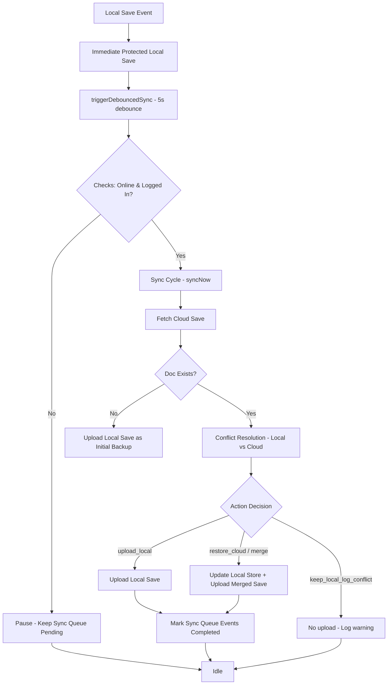

# Phase 19: Cloud Save & Firebase Optional Sync Layer

This document details the architecture, schema, firestore security rules, conflict resolution guidelines, and verification tests completed for Phase 19.

---

## 1. Architectural Overview

Phase 19 connects the secure local player progress and offline sync queue built in Phase 18 with Firebase Firestore as an optional background backup and synchronization system.



### Key Core Principles:
- **Local Save Primary**: Local protected save is the immediate source of gameplay, ELO adjustments, and rewards. It is never blocked by database network latency.
- **Firebase Optionality**: The application boots and operates fully without Firebase. If the user is offline, unauthenticated, or Firestore is down, all writes queue locally and fail silently without blocking local gameplay.

---

## 2. Cloud Save Document Schema

Located in `src/lib/cloud/cloudSaveSchema.ts`.

- **Schema Version**: `CLOUD_SAVE_SCHEMA_VERSION = "1.0.0"`.
- **Properties**:
  - `uid`: string (Auth User UID)
  - `playerData`: PlayerData (full signed nested JSON payload containing achievements, ELO, stats, etc.)
  - `aiProgress`: AIProgress (top-level career progress fields for indexing and analytics)
  - `coins`: number
  - `xp`: number
  - `badges`: string[]
  - `settings`: Object (nested settings subset: musicOn, sfxOn, lowGraphics, cameraSensitivity, language, boardTheme, preferredSide, etc.)
  - `saveVersion`: string
  - `updatedAt`: number (timestamp of local or cloud modification)
  - `deviceId`: string (origin device ID)
  - `localSaveHash`: string (SHA-256 local save checksum)
  - `lastSyncedAt`: number (timestamp of sync operation)

- **Migration**: Incorporates `migrateCloudSaveIfNeeded(data)` to easily parse and migrate older schemas in future updates.

---

## 3. Firestore Security Rules

Modified `firestore.rules` to define owner-only read/write constraints on `/cloudSaves/{userId}`:

```javascript
    // Cloud Saves collection
    match /cloudSaves/{userId} {
      allow read, write: if isOwner(userId);
    }
```

This enforces that authenticated users can only retrieve or modify their own backup saves, preventing tampering across accounts.

---

## 4. Conflict Resolution & Merging

Located in `src/lib/cloud/cloudConflictResolver.ts`.

Before merging, the system validates both data payloads using the secure `validatePlayerData()` bounds checking from Phase 17. Merging is aborted if the payloads violate limits (e.g. invalid ELO caps, coins, or XP).

### Resolution Rules:
1. **Local Newer**: If local `updatedAt` > cloud `updatedAt`, local save is uploaded.
2. **Cloud Newer**: If cloud `updatedAt` > local `updatedAt`, cloud save is merged and restored locally:
   - **Badges/Unlocks**: Union of badges and level unlocks (`unlockedTiers`, completed master cups).
   - **ELO/Coins/XP**: Restores the validated higher value within legal bounds.
   - **Device Settings**: Settings (volume, lowGraphics preference, preferredSide, pieces, themes, viewMode) are preserved from the **local device** to prevent overwriting settings suited for different hardware.
3. **Unclear Conflict**: If timestamps are equal or invalid, local save is kept and a warning is logged.

---

## 5. Sync Loop & Debouncing Safety

Located in `src/lib/cloud/cloudSyncManager.ts`.

- **Sync Status States**: Exposes status states: `idle`, `syncing`, `synced`, `failed`, `offline`, `unauthenticated`.
- **Debounced Writes**: To avoid spamming Firestore, all writes are batched and debounced with a 5-second window. Any save to `playerData` triggers `triggerDebouncedSync()`.
- **Visibility/App State**: Automatically pauses syncing (`pauseSync()`) when the app moves to the background, and resumes sync (`resumeSync()`) upon returning to the foreground.
- **Sync triggers**: Initiates on login, network restored, app foregrounded, match completed, or when pending events exist.

---

## 6. Verification & Test Results

### Automated Tests
Created `src/lib/cloud/__tests__/cloudSync.test.ts` mocking Firebase Firestore and testing:
- Offline users do not sync (**Pass**)
- Unauthenticated users do not sync (**Pass**)
- Invalid local data is rejected/blocked (**Pass**)
- Invalid cloud data is rejected (**Pass**)
- Local newer saves are uploaded (**Pass**)
- Cloud newer merges safely (union of badges, local settings preferred) (**Pass**)
- Unclear conflicts log warning and keep local (**Pass**)
- Failed uploads keep local sync queue intact (**Pass**)
- Successful uploads clear sync queue (**Pass**)
- Firestore permission-denied errors handle gracefully without crashing (**Pass**)

#### Test Suites Executed:
```bash
npx vitest run src/lib/cloud src/lib/offline src/game/security src/game/ai/__tests__/progression.test.ts
```
- `cloudSync.test.ts`: **10 Passed**
- `offline.test.ts`: **12 Passed**
- `security.test.ts`: **20 Passed**
- `progression.test.ts`: **38 Passed**
- **Overall**: **80/80 Tests Passed successfully**.

### Compilation & Linting
- `npm run lint` (`tsc --noEmit`): **Completed successfully (0 errors)**.
- `npm run build`: **Completed successfully**.
- `npx cap sync android`: **Completed successfully**.
