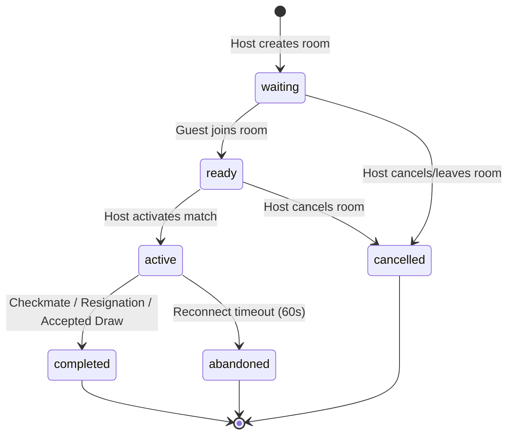

# Phase 20: Multiplayer Foundation (Firestore-synced Friend Match)

This document details the architecture, design, firestore security rules, transition guards, move verification checklist, and test results for Phase 20.

---

## 1. Architectural Overview

The Clash of Crowns multiplayer foundation provides a robust, Firestore-synced path for **Friend Matches** (non-ranked duels). By utilizing real-time Firestore collection listeners, players can play against each other with sub-second latency, synchronizing board state and presence without relying on a dedicated web-socket server.

```mermaid
sequenceDiagram
    autonumber
    actor Host as Host Player
    actor Guest as Guest Player
    participant DB as Firestore (multiplayerRooms)

    Host->>DB: createFriendRoom() (status: 'waiting', turn: 'w')
    DB-->>Host: roomId, QR Code, and invite payload
    Guest->>DB: joinRoom(roomId) (status: 'ready')
    DB-->>Host: Room snapshot update (status: 'ready')
    Host->>DB: markRoomActive() (status: 'active')
    DB-->>Guest: Room snapshot update (status: 'active')
    Note over Host, Guest: Game Starts (Host: White, Guest: Black)
    
    rect rgb(20, 20, 20)
        Note over Host, Guest: Game loop with move validation
        Host->>DB: submitMove(moveNumber: 1, FEN)
        DB-->>Guest: OnMovesSnapshot listener triggers
        Guest->>DB: submitMove(moveNumber: 2, FEN)
        DB-->>Host: OnMovesSnapshot listener triggers
    end
```

### Key Design Principles:
- **Firestore-synced (No Web-Socket Server Dependency)**: The game is fully peer-to-peer synced using Firebase Firestore. 
- **Offline Safety**: The multiplayer mode is protected by authentication and online status guards. Local AI Career, local Play vs Computer, and saved progress are completely unaffected and run offline.
- **Pure Friend Match (No Ranking)**: To prevent ladder farming or exploits, Phase 20 Friend Matches do not award ranked ELO, multiplayer ranks, or affect global leaderboards.

---

## 2. Room Lifecycle Status Transitions

Strict transition guards are enforced at the app layer (and secured in database rules) to prevent out-of-order room state modifications.

### Strict Transition Validation:
- `waiting` → `ready` (Valid guest joining)
- `ready` → `active` (Match start triggered by host)
- `active` → `completed` (Legal checkmate, resignation, draw)
- `active` → `abandoned` (Opponent disconnects and fails to reconnect within 60 seconds)
- `waiting` → `cancelled` (Host cancels room setup)
- `ready` → `cancelled` (Host cancels room setup)

All invalid transitions (e.g. `completed` → `active` or `cancelled` → `active`) are strictly blocked.

---

## 3. Sequential Move Syncing & Validation

To ensure chess state consistency and prevent tampering, moves are submitted to a sequential subcollection:
`multiplayerRooms/{roomId}/moves/{moveNumber}`

### Before Submission Checklist:
Every turn move processed in `GameScreen.tsx` (`handleSquareClick` and `handlePromotion`) performs five mandatory checks before writing to Firestore:
1. **Membership Validation**: Checks `validatePlayerInRoom(roomData, user.uid)` to verify the submitter is a participant.
2. **Active Room Check**: Verifies the room is currently in the `active` status.
3. **Turn Alignment**: Checks `validateTurn(roomData, user.uid, color)` to verify it matches the active player's color.
4. **Sequence Verification**: Validates that `moveNumber === roomData.moveCount + 1` to prevent race conditions or duplicate submissions.
5. **Local Legality Check**: Performs a full Chess logic verification using `validateLegalMove(boardStateFen, move)` to verify the move is valid according to chess rules.

Once validated, the move is saved to `/moves/{moveNumber}` and the parent room document is updated with the new FEN, active turn, and incremented `moveCount`.

---

## 4. Disconnect Reconnection & Draw Handling

### Reconnect Mechanism:
- Players maintain an online presence heartbeat: `/presence/{uid}` updated every 10 seconds.
- If a player disconnects, the opponent's screen triggers a **60-second reconnect countdown**.
- If the player reconnects, the countdown is cleared and gameplay resumes.
- If the countdown reaches 0, the remaining player is allowed to claim victory, marking the room status as `abandoned` via `submitResult()`.

### Draw Offer Flow:
- One-sided forced draws are blocked.
- Declaring a draw in multiplayer sends a **Draw Offer** to the opponent.
- The opponent can **Accept** or **Decline** the offer via a dialog overlay.
- Declining clears the offer and continues the match. Accepting completes the match as a draw.

---

## 5. Security Rules

The Firestore rules enforce strict data access constraints:
- Only authenticated users who are part of the room (either Host or Guest) can read the room's data.
- Only the Host or Guest can create/update room, move, and result documents.
- User presence documents can only be written by the user themselves (`isOwner(userId)`).

---

## 6. Verification and Test Results

### Automated Tests Passed:
All unit test suites executed and passed successfully:
1. `src/game/multiplayer/__tests__/multiplayer.test.ts` (Multiplayer lifecycle, room creation, moves, and presence): **13 passed**
2. `src/lib/cloud/__tests__/cloudSync.test.ts` (Firebase cloud sync and merge logic): **10 passed**
3. `src/lib/offline/__tests__/offline.test.ts` (Offline runtime and local caching): **12 passed**
4. `src/game/security/__tests__/security.test.ts` (Protected saves, checksums, and recovery): **20 passed**
5. `src/game/ai/__tests__/progression.test.ts` (AI tier progression scaling and unlocking): **38 passed**

**Total: 93/93 Tests Passed.**

### Compilation and Build:
- **TypeScript Typecheck (`tsc --noEmit`)**: Completed with **0 errors**.
- **Production Build (`npm run build`)**: Completed successfully.
