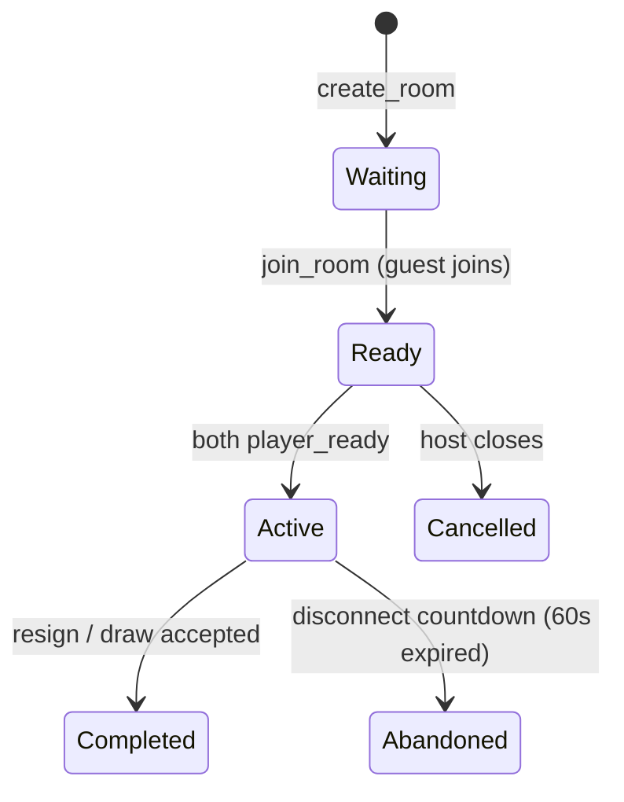

# Phase 25: Rust Realtime Multiplayer Backend Foundation

This document outlines the design, implementation, and verification of the Clash of Crowns Rust-based WebSocket backend foundation. This backend provides high-performance, low-latency, thread-safe in-memory state tracking to support realtime multiplayer matches alongside the existing Firestore database.

---

## 1. Goal & Architecture

To scale Friend Match multiplayer capabilities and lay the foundation for ranked Arena gameplay, we built a modular Rust server on top of the **Axum** framework and **Tokio** runtime:
- **WebSocket Protocol**: Fully-typed message deserialization/serialization with protocol version checks and message mapping IDs.
- **In-Memory Room Manager**: High-speed, thread-safe room registry using `DashMap`.
- **Server-Side Move Verification**: Strict sequence and turn checking (`moveNumber`, turn color, active status, duplicate checking).
- **Heartbeat & Presence Loop**: Auto-reconnect mapping using `connectionId` values to drop stale sockets and handle temporary internet dropouts.
- **Frontend Fallback**: Firestore remains the primary active path; a TypeScript realtime client shell is prepared but does not disrupt current gameplay.

### Folder Structure
```text
src-rust/
├── Cargo.toml
├── README.md
├── .env.example
├── src/
│   ├── main.rs                 # Server entrypoint & routing
│   ├── config.rs               # Environment configuration reader
│   ├── state.rs                # Shared AppState & connection registry
│   │
│   ├── ws/
│   │   ├── mod.rs              # Websocket module exporter
│   │   ├── handler.rs          # WebSocket upgrade endpoint
│   │   ├── protocol.rs         # Client/Server message schemas
│   │   └── connection.rs       # Connection read/write loops
│   │
│   ├── rooms/
│   │   ├── mod.rs              # Rooms module exporter
│   │   ├── room_state.rs       # RoomState & PlayerSlot models
│   │   ├── room_manager.rs     # In-memory DashMap room manager
│   │   └── room_errors.rs      # Strongly typed error definitions
│   │
│   ├── chess/
│   │   ├── mod.rs              # Chess module exporter
│   │   └── move_validator.rs   # Turn & sequence validation rules
│   │
│   ├── presence/
│   │   ├── mod.rs              # Presence module exporter
│   │   └── heartbeat.rs        # Heartbeat ping processing
│   │
│   ├── auth/
│   │   ├── mod.rs              # Auth module exporter
│   │   └── token.rs            # Protocol version & dev auth validation
│   │
│   └── tests/
│       ├── mod.rs              # Tests module exporter
│       └── protocol_tests.rs   # Integration and unit tests
```

---

## 2. WebSocket Message Protocol

The protocol enforces snake_case tagging (`#[serde(tag = "type", rename_all = "snake_case")]`).

### A. Client $\rightarrow$ Server Messages (`ClientMessage`)
- **`Auth`**: Transmits player identification and enforces the protocol version:
  ```json
  {
    "type": "auth",
    "uid": "user_123",
    "display_name": "Royal Knight",
    "token": "optional_token_string",
    "protocol_version": "1.0.0"
  }
  ```
- **`CreateRoom`**: Host creates a match. Supports optional requested `room_id`.
- **`JoinRoom`**: Guest joins the target `room_id`.
- **`PlayerReady`**: Player marks themselves ready.
- **`SubmitMove`**: Submits move coordinates and new FEN:
  ```json
  {
    "type": "submit_move",
    "room_id": "CH-12345",
    "move_number": 1,
    "from": "e2",
    "to": "e4",
    "promotion": null,
    "fen_after": "rnbqkbnr/pppppppp/8/8/4P3/8/PPPP1PPP/RNBQKBNR b KQkq - 0 1",
    "san": "e4",
    "client_message_id": "optional-uuid-string"
  }
  ```
- **`OfferDraw` / `RespondDraw`**: Propose and respond to draw agreements.
- **`Resign`**: Resigns the active match.
- **`Heartbeat`**: Updates last-seen timestamp.

### B. Server $\rightarrow$ Client Messages (`ServerMessage`)
- **`AuthOk`**: Confirms session acceptance.
- **`Error`**: Communicates failures (e.g. `protocol_version_mismatch`, `out_of_turn`). Echoes `client_message_id` on move failures.
- **`RoomCreated` / `RoomJoined`**: Acknowledges room setups.
- **`RoomState`**: Broadcasts the full room state to both players.
- **`MoveAccepted`**: Confirms the move is valid to the sender.
- **`OpponentMove`**: Relays move details to the other player in the room.
- **`OpponentDisconnected` / `OpponentReconnected`**: Relays connection updates.
- **`MatchEnded`**: Resolves outcomes.
- **`Pong`**: Confirms heartbeats.

---

## 3. Room Lifecycle & State Machine



1. **`Waiting`**: Initial state on `CreateRoom`. White (host) slot is filled, Black (guest) is `None`.
2. **`Ready`**: Entered when a guest successfully joins the room.
3. **`Active`**: Triggered when both players emit `PlayerReady`. Turn starts at White (`'w'`) and `moveCount` is `0`.
4. **Completed / Abandoned**: Terminal states where further moves are blocked.

---

## 4. Server-Side Move Validation

Before updating room state, the server executes sequencing validations in [move_validator.rs](file:///c:/Users/tripu/OneDrive/Desktop/clash-of-crowns/src-rust/src/chess/move_validator.rs):
1. **Room State**: Verifies the room status is strictly `Active`. Rejecting if completed, cancelled, or abandoned.
2. **Player Membership**: Asserts the player's UID matches the room's white or black slots.
3. **Turn Order**: Asserts the player's slot color matches `room.current_turn` (`"w"` or `"b"`).
4. **Sequence Mismatch**: Asserts `move_number == room.move_count + 1`. If `move_number <= room.move_count`, it rejects as a duplicate move.
5. **FEN Recording**: Updates the FEN and toggles the turn.
   *(TODO: Phase 26 will integrate a chess crate like shakmaty to recompute and validate FEN legality).*

---

## 5. Heartbeat, Presence, & Duplicate Connection Eviction

- **Heartbeat**: Clients submit a `Heartbeat` message every 10 seconds. The server responds with `Pong` and updates `last_seen_ms`.
- **Disconnect**: If the socket closes, the server marks the slot as disconnected (`connected = false`), starts a 60-second reconnect window, and notifies the opponent via `OpponentDisconnected`.
- **Reconnect**: Reconnecting via the same UID restores the player state to `connected = true` and relays `OpponentReconnected` to resume the game.
- **Eviction**: If the same `uid` establishes a new socket connection while an old one is still active, the server evicts the old connection by registering the new `UnboundedSender` and closing the old channel using a unique `connection_id`.

---

## 6. TypeScript RealtimeClient Fallback Strategy

The TypeScript class [realtimeClient.ts](file:///c:/Users/tripu/OneDrive/Desktop/clash-of-crowns/src/services/realtime/realtimeClient.ts) serves as a connection manager:
- Operates on a separate layer (`ws://localhost:3001/ws`).
- Provides auto-reconnection, authentication handshakes, and heartbeat loops.
- Emits callback events (`onOpen`, `onClose`, `onMessage`).
- Sets `fallbackToFirestore = true` if the WebSocket fails or is disconnected, ensuring that the existing Firestore multiplayer path remains the active path in Phase 25.

---

## 7. Verification & Testing

### A. Rust Unit & Integration Tests
A suite of 9 tests in [protocol_tests.rs](file:///c:/Users/tripu/OneDrive/Desktop/clash-of-crowns/src-rust/src/tests/protocol_tests.rs) verifies the state machine:
- `test_protocol_version_mismatch`: Rejects version `0.9.0`, accepts `1.0.0`.
- `test_room_lifecycle_create_waiting`: Validates room setup.
- `test_room_lifecycle_join_ready`: Guest join updates status.
- `test_room_lifecycle_both_ready_active`: Transition to active on dual ready.
- `test_move_validation_wrong_turn_rejected`: Out-of-turn moves return `OutOfTurn`.
- `test_move_validation_wrong_move_number_rejected`: Future moves return `MoveNumberMismatch`.
- `test_move_validation_duplicate_move_rejected`: Repeating moves return `DuplicateMoveNumber`.
- `test_move_validation_completed_room_rejects_moves`: Terminal rooms reject moves.
- `test_reconnect_same_uid_works`: Connection updates match states.

### B. Compilation & Test Results
- **Rust Toolchain**: Compiled successfully with **0 warnings** on the 32-bit GNU toolchain:
  ```text
  9 passed; 0 failed; 0 ignored; 0 measured; 0 filtered out
  ```
- **TypeScript Linter**: `npm run lint` compiles cleanly with no errors.
- **Vite Client Production Build**: `npm run build` completed successfully.
- **Vitest Suites**: All 133 frontend tests (social, multiplayer, leaderboard, cloud, offline, security, progression) pass cleanly.
