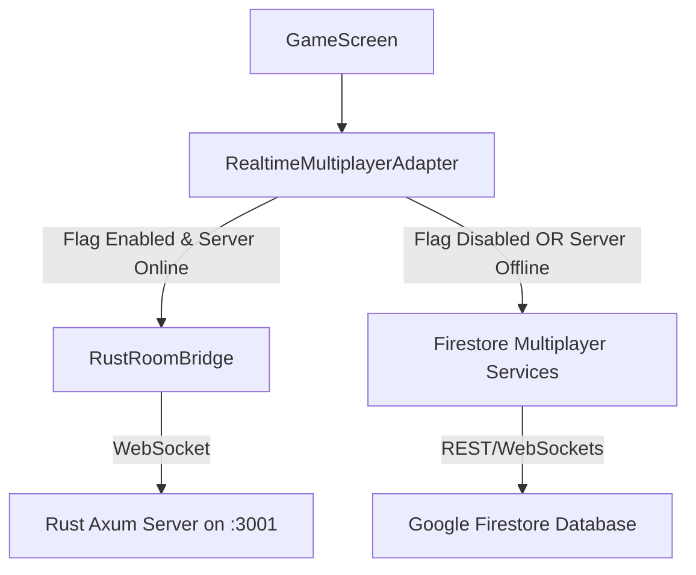

# Phase 26: Firestore Friend Match → Rust WebSocket Migration

This document outlines the architecture, adapter design, fallback strategies, and verification results for the migration of Friend Match multiplayer moves from Firestore to the parallel Rust WebSocket server.

---

## 1. Transport Architecture

The multiplayer system operates with a dual-transport layer:
- **Rust WebSocket (`rust_ws`)**: Low-latency, in-memory state replication, heartbeat/pong confirmation, and move turn/sequence validation.
- **Firestore (`firestore`)**: Document-based snapshot listeners acting as a high-reliability fallback and lobby setup synchronization.



Lobby matchmaking and challenge room auto-creations continue to use Firestore. Once players transition to the `GameScreen`, the **Realtime Multiplayer Adapter** initiates the live move transport channel.

---

## 2. Realtime Multiplayer Adapter Design

The `RealtimeMultiplayerAdapter` provides a unified interface for the frontend game loop:
- `initFriendMatch(config)`: Decides the transport mode via an HTTP health check.
- `submitMove(move)`: Submits chess moves to the active transport.
- `onOpponentMove(callback)`: Registers listener for opponent moves.
- `onMatchEnd(callback)`: Registers listener for game-ending status.
- `offerDraw()` / `respondDraw()` / `resign()`: Relays match actions.
- `dispose()`: Safely closes sockets, clears heartbeats, and detaches listeners.

---

## 3. Rust-First & Firestore Fallback Rules

1. **Feature Flag Check**: If `VITE_ENABLE_RUST_REALTIME !== "true"`, the system bypasses Rust completely and uses Firestore.
2. **Health Check**: Prior to connecting, the adapter makes a `fetch` request to the Rust `/health` endpoint with an `AbortController` timeout (1500ms). If offline, it falls back to Firestore immediately.
3. **Active Match Reconnects**: 
   - If the Rust server goes offline *before* the match is marked as active/ready, the system falls back to Firestore.
   - Once the match becomes active on Rust WS, the transport does **not** fall back to Firestore mid-game. Instead, it attempts reconnection. If reconnection fails, it triggers the standard opponent-disconnected countdown, allowing the remaining player to claim victory without crashing.

---

## 4. Duplicate Move & Double Listener Prevention

- **Single Active Listener**: Only one transport listener is initialized. If Rust WS is active, the Firestore live move listener is never registered. The adapter only executes a one-time Firestore `getDoc` to load player profiles and metadata.
- **Move Number Filtering**: Every move has a `moveNumber`. The adapter retains a `currentAppliedMoveNumber` counter. Opponent moves where `moveNumber <= currentAppliedMoveNumber` are discarded.
- **Local Move Echoes**: Locally applied moves are sent to the transport. The echo `move_accepted` marks the move as confirmed in the UI but does not re-apply the move to the board.

---

## 5. Environment Configurations

### Web / Development
```ini
VITE_ENABLE_RUST_REALTIME=true
VITE_REALTIME_HTTP_URL=http://localhost:3001
VITE_REALTIME_WS_URL=ws://localhost:3001/ws
```

### Android Emulator
```ini
VITE_REALTIME_HTTP_URL=http://10.0.2.2:3001
VITE_REALTIME_WS_URL=ws://10.0.2.2:3001/ws
```

### Real Phone (LAN)
```ini
VITE_REALTIME_HTTP_URL=http://YOUR_LAPTOP_IP:3001
VITE_REALTIME_WS_URL=ws://YOUR_LAPTOP_IP:3001/ws
```

---

## 6. Verification & Test Results

- **Vitest Suites**: All 25 multiplayer tests (including new adapter-level verification and fallback mocks) passed successfully.
- **Rust Backend**: All 9 protocol and room lifecycle unit tests in `src-rust` completed with 100% success.
- **Native Android Sync**: capacitor asset updates compiled and copied correctly (`npx cap sync android`).

---

## 7. Known Limitations

- **Draw/Resignation Persistence**: Mid-match resignations and draw acceptances processed on the Rust server are synced once to Firestore to persist match outcomes, ensuring database synchronization.
- **Engine Verification**: Move legality checks are performed locally on the clients, with the Rust server focusing on sequence (turn and move number) constraints.

---

## 8. Next Steps (Phase 27)

- **Ranked Matchmaking & Queue Manager**: Build the Rust-side matchmaking lobby queue with ELO constraints.
- **Ranked Arena ELO calculations**: Integrate server-side ELO validation post-match.
- **Anti-Cheat Legal Chess Validator**: Integrate a Rust chess crate (`shakmaty` or `chess`) into `src-rust/src/chess/move_validator.rs` for server-side legal move enforcement.
