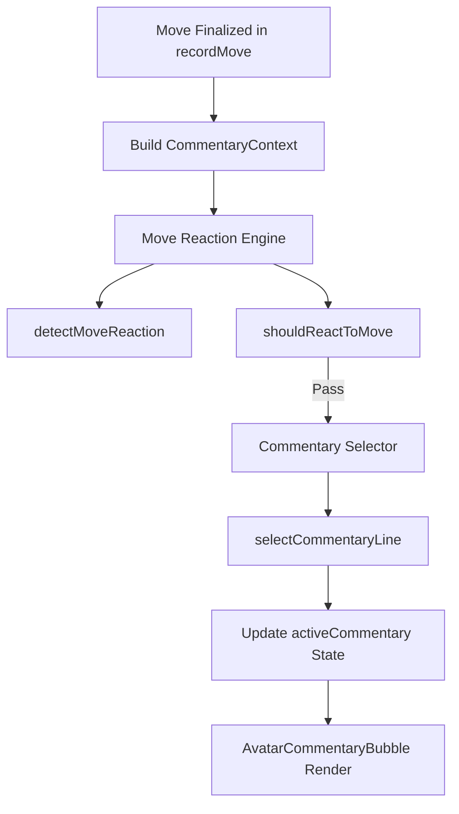

# Phase 28 — Advanced Avatar Commentary / Move Reaction

This phase implements a lightweight, performant avatar and match commentary system to make single-player and multiplayer chess matches feel alive.

---

## 1. Commentary Architecture

The system is decoupled into pure data processing engines and a lightweight UI overlay, ensuring zero render loops or performance bottlenecks:

- **Move Reaction Engine**: Decouples trigger evaluation from the main UI component. Runs once per finalized move outside the render loops.
- **Commentary Lines DB**: Mappings of playbooks for various tones.
- **UI Bubble Overlay**: Renders outside the 3D and 2D canvas, is `pointer-events-none` (except for content body), and utilizes safe timeouts to auto-hide.

---

## 2. Trigger Priorities

Move triggers are prioritized to prevent overlapping reactions. The trigger with the highest priority is resolved first:

| Priority | CommentaryTrigger | Condition / Heuristic |
| :--- | :--- | :--- |
| **10** (Highest) | `checkmate` / match results | `chess.isCheckmate()` or match outcomes |
| **8** | `check` | `chess.isCheck()` or SAN ends in `+` |
| **7** | `promotion` | Pawn reaches 8th/1st rank or promotion flag set |
| **6** | `capture` | Captured piece exists in move payload |
| **5** | `castle` | Move flag represents king/queen castling |
| **4** | `blunder_warning` | Eval difference: Side-aware improvement $< -15$ |
| **3** | `good_move` | Eval difference: Side-aware improvement $> 10$ |
| **2** | `endgame_pressure` | Remaining pieces $\le 12$ |
| **1** (Lowest) | `normal_move` | Fallback when no other triggers match |

---

## 3. Cooldown Rules

To avoid spamming commentary on every single move, the engine enforces priority-based cooldowns:

- **High Priority** (Checkmate, Match results): **0ms** (always triggers instantly).
- **Medium-High Priority** (Check, Promotion): **2500ms** cooldown.
- **Medium Priority** (Capture, Castle, Blunder): **4500ms** cooldown.
- **Low Priority** (Normal Move, Good Move): **6000ms** cooldown.
- **Early-Game Restraint**: Low-priority commentary is skipped entirely for the first 3 moves of the game.
- **Randomness**: Normal moves have a **20%** chance to trigger (using a test-safe injectable randomizer).
- **No Consecutive Repeats**: The same line will not be selected twice in a row.

---

## 4. Tone Mapping

Tones are mapped dynamically based on the match type and character selection:

- **Friend Match / Multiplayer / Local VS**:
  - Maps to `neutral` tone.
  - Event-based reactions only. No funny taunts, insults, or engine advice.
- **Core / Beginner Career AI**:
  - Maps to `friendly` and `encouraging` tones.
- **Learner / Promotion Trial Career AI**:
  - Maps to `funny` and `friendly` tones.
- **Intermediate / Hard Career AI**:
  - Maps to `tactical` and `serious` tones.
- **Master / Grandmaster Career AI**:
  - Maps to `boss` and `serious` tones.

---

## 5. Performance Safety Rules

1. **Lightweight Evaluation**: Side-aware eval changes only use existing cached evaluations from the local store or previous moves. No new engine searches or Stockfish processes are spawned.
2. **Outside Render Loops**: The reaction logic is invoked strictly inside `recordMove` once after a move is applied. It is not run inside `requestAnimationFrame`, Fibre frame loops, or Three.js animations.
3. **Timer Cleanup**: Timeouts inside `AvatarCommentaryBubble` are garbage collected on unmount to prevent memory leaks.
4. **Non-blocking overlays**: The floating commentary bubble uses `pointer-events-none` on its container to ensure board clicks and drag gestures are never obstructed.

---

## 6. Verification Results

### Automated Tests
The new test suite `src/game/commentary/__tests__/moveReactionEngine.test.ts` completed successfully with **8/8 tests passing**:
- Verified checkmate priority (10) beats check and capture.
- Verified side-aware eval works for White and Black players.
- Verified missing evaluations do not crash the app.
- Verified neutral tone mapping for Friend Matches.
- Verified cooldown tracking and checkmate cooldown bypasses.
- Verified test-safe randomness.
- Verified repeated line filter.

All other 138 frontend tests and 9 Rust backend cargo tests passed.

---

## 7. Known Limitations
- Commentary is displayed in textual form only (speech bubble). Adding text-to-speech or audio vocal responses requires additional sound assets and is deferred.

---

## 8. Next Recommended Phase

### Phase 29: Sound FX & Voice Polish
- Add unique dialogue sounds, typing sounds, or custom chime audio cues when commentary bubbles mount.
