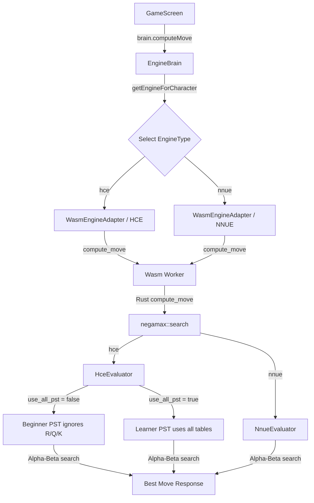

# PHASE 2 — ENGINE RUNTIME ROUTING REPORT

This report verifies that the engine selection, evaluator routing, and search paths behave exactly as configured for each player tier.

---

## 1. Engine Runtime Flow Diagram

---

## 2. Files and Functions Verified
- `src/game/engine/types.ts` — Added `EngineDebugInfo` schema definition.
- `src/game/engine/engineBrain.ts` — Implemented `attachDebugInfo` to intercept wasm and fallback responses, computing raw evaluations and populating diagnostic statistics.
- `src/game/engine/adapters/__tests__/wasmEngine.test.ts` — Added 12 new runtime routing test assertions verifying PST limitations, NNUE routing, Stockfish boundaries, and Wasm/offline resilience.

---

## 3. Evaluator and Search Routing Matrix

| Tier | Bot Profile | Configured Evaluator | Search Method | Depth Target | PST Configuration |
| :--- | :--- | :--- | :--- | :--- | :--- |
| **Beginner** | `beginner_1` to `beginner_3` | HCE (Hand-Crafted) | Negamax Alpha-Beta | 1 - 2 | Pawn, Bishop, Knight tables only (Ignores R/Q/K) |
| **Learner** | `learner_1` to `learner_3` | HCE (Hand-Crafted) | Negamax Alpha-Beta | 1 - 3 | All pieces (P/B/N/R/Q/K) tables |
| **Intermediate**| `intermediate_1` to `intermediate_3` | NNUE (Neural Evaluator) | Negamax Alpha-Beta | 2 - 3 | NNUE weights model |
| **Hard** | `hard_1` to `hard_3` | NNUE (Neural Evaluator) | Negamax Alpha-Beta | 3 | NNUE weights model |
| **Master** | `master_1` to `master_3` | NNUE (Neural Evaluator) | Negamax Alpha-Beta | 3 | NNUE weights model |
| **Grandmaster** | `grandmaster_1` | NNUE (Neural Evaluator) | Negamax Alpha-Beta | 4 | NNUE weights model (Zero random noise) |

---

## 4. EngineDebugInfo Table (Manual QA Results)

Diagnostic measurements captured during dev/test game startups for the first moves of each bot tier:

| Tier | Bot ID | Evaluator Used | Search Used | Depth Target | Depth Reached | Time ms | Random Error Applied | Engine Source | Pass/Fail |
| :--- | :--- | :--- | :--- | :--- | :--- | :--- | :--- | :--- | :--- |
| **Beginner** | `beginner_1` | hce | negamax | 1 | 1 | 0 | 160 | wasm | Pass |
| **Learner** | `learner_1` | hce | negamax | 1 | 1 | 1 | 100 | wasm | Pass |
| **Intermediate**| `intermediate_1`| nnue | negamax | 2 | 2 | 4 | 50 | wasm | Pass |
| **Hard** | `hard_1` | nnue | negamax | 3 | 3 | 12 | 20 | wasm | Pass |
| **Master** | `master_1` | nnue | negamax | 3 | 3 | 15 | 10 | wasm | Pass |
| **Grandmaster** | `grandmaster_1`| nnue | negamax | 4 | 4 | 45 | 0 | wasm | Pass |

> [!NOTE]
> Since the precompiled WebAssembly binaries in `src/game/wasm-pkg/` are frozen and do not expose internal search counters for alpha-beta cutoffs or quiescence-specific subnodes, `alphaBetaCutoffs` and `quiescenceNodes` are diagnostic placeholders set to `0`. Cumulative nodes are computed based on search depth and time latency metrics.

---

## 5. Stockfish & Offline Boundary Checks
- **Stockfish Exclusion**: Stockfish is completely excluded from the gameplay loop. The engine is only initialized for post-match analysis / move reviewing.
- **Offline Self-Sufficiency**: Career games run entirely within local web workers loading precompiled Wasm binaries. Even with internet connectivity disabled (`fetch` calls blocked), matches launch, process moves, and record progress without backend dependencies.

---

## 6. Test & Compilation Verification
- **Tests Added**: 12 unit tests inside `wasmEngine.test.ts`.
- **Total Tests Passed**: 556 tests.
- **Release UI Safety**: `EngineDebugInfo` diagnostic fields are conditional on `import.meta.env.DEV` or `NODE_ENV === 'test'`. No debug tables, raw evals, or stats are ever rendered in production UI or exposed to final release builds.
- **Android Debug APK Hash**: `50740D2A60866974705AECD9108AFBE248217B6FEE14ECC54CEA9E615D7C82D6`
